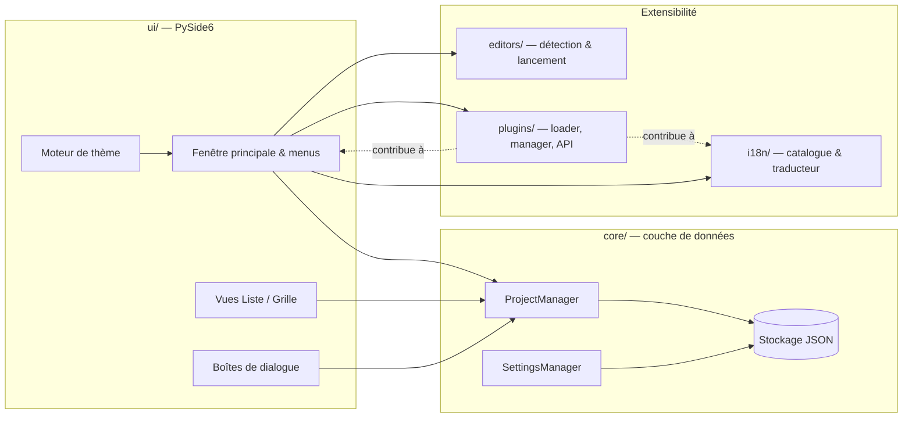

<p align="center">
  
</p>

<h1 align="center">MyAppsLibrary</h1>

<p align="center">
  <strong>Un lanceur de bureau natif et rapide pour tous vos projets de développement — organisés, cherchables, et ouverts en un clic dans votre éditeur préféré.</strong>
</p>

<p align="center">
  <a href="README.md">🇬🇧 Read in English</a>
</p>

<p align="center">
  <a href="https://github.com/rodolphe37/my-apps-library/actions/workflows/ci.yml"></a>
  <a href="LICENSE"></a>
  <a href="pyproject.toml"></a>
  <a href="https://pypi.org/project/PySide6/"></a>
  
  <a href="https://github.com/astral-sh/ruff"></a>
  <a href="CHANGELOG.md"></a>
  <a href="CONTRIBUTING.md"></a>
</p>

<p align="center">
  
  
  
</p>

---

## Sommaire

- [Présentation](#présentation)
- [Fonctionnalités](#fonctionnalités)
- [Éditeurs supportés](#éditeurs-supportés)
- [Installation](#installation)
- [Prise en main](#prise-en-main)
- [Le système de plugins](#le-système-de-plugins)
- [Internationalisation](#internationalisation)
- [Architecture](#architecture)
- [Organisation du projet](#organisation-du-projet)
- [Développement](#développement)
- [Packaging / créer des installeurs](#packaging--créer-des-installeurs)
- [Feuille de route](#feuille-de-route)
- [Contribuer](#contribuer)
- [Communauté](#communauté)
- [Licence](#licence)
- [Auteur](#auteur)

## Présentation

Si vos projets sont éparpillés dans une dizaine de dossiers, sur plusieurs disques, à des stades divers de « je m'y remets plus tard » — **MyAppsLibrary** est une petite application de bureau native qui leur donne un seul foyer. Pointez-la une fois vers un dossier, et vous obtenez ensuite une bibliothèque cherchable, filtrable et catégorisée, qui ouvre n'importe quel projet dans l'éditeur de votre choix en un seul clic.

Ce n'est **pas** un service cloud, un système de comptes, ni un gestionnaire de projet avec des avis sur votre façon de travailler. L'application ne stocke que des références de dossiers et des métadonnées, entièrement sur votre machine, sans jamais toucher à vos fichiers ni contacter le réseau de sa propre initiative.

- 🖥️ **Application de bureau native** — construite avec [PySide6](https://doc.qt.io/qtforpython/) (Qt pour Python), pas Electron
- 🔒 **Local-first & hors-ligne** — la liste de vos projets vit dans un stockage JSON local ; rien n'est envoyé où que ce soit
- 🧩 **Extensible** — un système de plugins façon VS Code permet à la communauté d'ajouter des fonctionnalités sans forker le projet
- 🌍 **Multilingue** — anglais et français inclus, et d'autres langues via des plugins
- 🎨 **Personnalisable** — thème clair/sombre qui suit l'OS, construit autour du dégradé de marque de l'application

## Fonctionnalités

- **Ajout / suppression de projets** — uniquement des références de dossiers, vos fichiers ne sont jamais touchés ni déplacés. Ajout via une boîte de dialogue ou par **glisser-déposer** d'un ou plusieurs dossiers, en vue liste comme en vue grille.
- **Sélection multiple** — `Ctrl`/`Cmd`-clic et `Shift`-clic pour une sélection par plage (la même convention que le Finder/l'Explorateur), avec des actions groupées : modifier les catégories, épingler/désépingler et supprimer, appliquées à toute la sélection en une seule fois.
- **Catégories entièrement personnalisées** — aucune catégorie prédéfinie/générique. Créez-en autant que vous voulez (**Projet → Gérer les catégories…**), assignez un projet à plusieurs catégories à la fois via clic droit → **Modifier les catégories…** (compatible sélection multiple, avec cases à cocher à trois états quand la sélection est mixte), ou glissez un projet sur une catégorie dans la barre latérale pour l'y déplacer directement.
- **Tri** par nom, date d'ajout, date de modification (l'horodatage du système de fichiers du dossier lui-même) ou taille, croissant ou décroissant (**Affichage → Trier par**) — les projets épinglés remontent toujours en haut, quel que soit le tri.
- **Recherche et filtrage** par nom et par catégorie.
- **Vues liste et grille/miniatures**, basculables depuis le menu Affichage, avec conservation de la sélection lors du changement.
- **Détection automatique des éditeurs** — VS Code, Cursor, Sublime Text, IDE JetBrains, Zed, VSCodium, et plus (voir [Éditeurs supportés](#éditeurs-supportés)) ; ouvrez un projet directement dans l'un d'eux, ou utilisez **« Ouvrir avec… »** pour en choisir un autre ou en enregistrer un personnalisé.
- **Révéler dans l'explorateur de fichiers** — clic droit → « Afficher dans le Finder/l'Explorateur » pour accéder directement au dossier d'un projet.
- **Thème clair/sombre** avec détection automatique de l'OS, plus un interrupteur manuel. Toute l'interface (contour de sélection, barre latérale, boutons) est stylée autour du dégradé bleu-violet du logo de l'application (voir [`src/myapps/ui/theme/brand.py`](src/myapps/ui/theme/brand.py)) ; un projet sélectionné est mis en valeur par une bordure de couleur d'accent plutôt qu'un fond plein, pour que ses propres couleurs d'icône/badge restent lisibles.
- **Barre de menus native** avec toutes les actions principales, entièrement utilisable au clavier.
- **Système de plugins** — installation depuis un `.zip` ou un dossier local, activation/désactivation depuis **Plugins → Gérer les plugins…** ; les plugins peuvent contribuer des actions de menu contextuel, des actions de menu, de nouveaux modes d'affichage et des traductions. **Plugins → Parcourir la Marketplace…** ouvre l'application web compagnon [marketplace de plugins](https://github.com/rodolphe37/my-apps-library-plugins-marketplace) dans votre navigateur — l'application elle-même reste hors-ligne, et les installations restent uniquement locales (`.zip`/dossier).
- **Interface multilingue** — anglais et français inclus, changeables à la volée depuis **Préférences → Langue** sans redémarrage, et extensible par des plugins de traduction tiers.

> Prochaines étapes prévues : signature de code/notarisation, mise à jour automatique. Voir la [feuille de route](#feuille-de-route).

## Éditeurs supportés

MyAppsLibrary détecte automatiquement ceux qui sont installés sur votre système parmi :

| Éditeur | | Éditeur | |
|---|---|---|---|
| Visual Studio Code | ✅ | IntelliJ IDEA | ✅ |
| VS Code – Insiders | ✅ | WebStorm | ✅ |
| Cursor | ✅ | GoLand | ✅ |
| VSCodium | ✅ | CLion | ✅ |
| Sublime Text | ✅ | RubyMine | ✅ |
| Zed | ✅ | Neovide (Neovim) | ✅ |
| PyCharm | ✅ | *votre favori, via « Ouvrir avec… »* | ➕ |

Le vôtre n'y est pas ? Utilisez **« Ouvrir avec… »** pour ajouter n'importe quel éditeur personnalisé par son chemin, ou ouvrez une PR sur [`src/myapps/editors/catalog.py`](src/myapps/editors/catalog.py) — voir [Contribuer](#contribuer).

## Installation

MyAppsLibrary est pour l'instant distribuée depuis les sources, le temps que les installeurs packagés (`.dmg` macOS, installeur Windows, `AppImage` Linux) soient finalisés — voir [Packaging](#packaging--créer-des-installeurs) et la [feuille de route](#feuille-de-route).

```bash
git clone https://github.com/rodolphe37/my-apps-library.git
cd my-apps-library

python3 -m venv .venv
source .venv/bin/activate      # Windows : .venv\Scripts\activate

pip install -e ".[dev]"
python -m myapps
```

Prérequis : **Python 3.11+** et un environnement de bureau capable de faire tourner des applications Qt (Windows, macOS, ou Linux avec un serveur d'affichage).

## Prise en main

1. Lancez l'application avec `python -m myapps` (ou la commande `myapps` une fois installée).
2. **Ajoutez votre premier projet** : `Projet → Ajouter un projet…`, ou glissez simplement un dossier sur la fenêtre.
3. **Organisez** : créez des catégories depuis `Projet → Gérer les catégories…`, puis glissez des projets sur une catégorie dans la barre latérale, ou clic droit → *Modifier les catégories…* pour une assignation groupée.
4. **Ouvrez-le** : cliquez sur un projet pour l'ouvrir dans son éditeur détecté par défaut, ou clic droit → *Ouvrir avec…* pour en choisir un autre.
5. **Personnalisez** : changez le thème et la langue depuis `Préférences`, épinglez vos projets les plus utilisés, et essayez les vues *Liste*/*Grille* depuis le menu `Affichage`.

## Le système de plugins

MyAppsLibrary embarque une petite API de plugins façon VS Code, pour que la communauté puisse étendre l'application sans la forker.

- Installez un plugin depuis un `.zip` ou un dossier local via **Plugins → Gérer les plugins…**
- Un plugin peut contribuer :
  - Des **actions de menu contextuel** sur les projets (`contribute_project_context_actions`)
  - Des **actions de barre de menus** (`contribute_menu_actions`)
  - De **nouveaux modes d'affichage** (`contribute_views`)
  - Des **traductions** — nouvelles langues ou surcharges de langues existantes (`contribute_translations`)
  - Des hooks de cycle de vie : `on_load`, `on_unload`, `on_project_added`, `on_project_removed`, `on_project_opened`
- Chaque plugin reçoit un unique objet `PluginContext` (jamais les objets internes de l'application) — voir [`src/myapps/plugins/api.py`](src/myapps/plugins/api.py) pour le contrat complet.
- Les plugins tournent actuellement avec tous les privilèges de l'application et **ne sont pas isolés (sandbox)** ; l'application affiche un avertissement de confiance la première fois qu'on active un nouveau plugin. Une véritable isolation est prévue dans la [feuille de route](#feuille-de-route).

Deux exemples minimaux et fonctionnels sont inclus :

| Plugin | Démontre |
|---|---|
| [`examples/plugins/open_in_terminal`](examples/plugins/open_in_terminal) | Contribution au menu contextuel, déclaration de `permissions` |
| [`examples/plugins/recently_opened_logger`](examples/plugins/recently_opened_logger) | Hook `on_project_opened`, contribution de menu, `ctx.storage_dir`, `ctx.settings` |
| [`examples/plugins/german_translation`](examples/plugins/german_translation) | Ajout d'une langue entièrement nouvelle (`de`) via `contribute_translations` |

**`Plugins → Parcourir la Marketplace…`** ouvre l'application web compagnon [marketplace de plugins](https://github.com/rodolphe37/my-apps-library-plugins-marketplace) — elle lit la variable d'environnement `MYAPPS_MARKETPLACE_URL`, avec un repli sur `http://localhost:5173` (l'adresse de dev locale de la marketplace) tant qu'aucun domaine de production n'existe.

## Internationalisation

L'interface est fournie en **anglais** et en **français**, changeables à la volée depuis **Préférences → Langue** — aucun redémarrage requis. Les traductions vivent dans [`src/myapps/i18n/locales/`](src/myapps/i18n/locales/) sous forme de catalogues JSON clé/valeur, chargés via [`src/myapps/i18n/translator.py`](src/myapps/i18n/translator.py).

Ajouter une langue est volontairement simple :

- **En tant que langue intégrée** : ajoutez `src/myapps/i18n/locales/<code>.json` en reprenant les clés de `en.json`, y compris la clé réservée `meta.language_name` pour son nom affiché dans le menu déroulant des Préférences.
- **En tant que plugin** : implémentez `contribute_translations()` pour ajouter une nouvelle langue ou corriger des chaînes dans une langue existante — voir [`examples/plugins/german_translation`](examples/plugins/german_translation) pour un exemple complet et fonctionnel.

Les clés manquantes retombent sur l'anglais, donc une traduction partielle ou en cours ne casse jamais l'interface. Les contributions de nouvelles langues sont les bienvenues — voir [Contribuer](#contribuer).

## Architecture



Tout est persisté dans un stockage JSON local, écrit de façon atomique (voir [`src/myapps/core/store.py`](src/myapps/core/store.py)) dans le répertoire de données applicatif standard de votre OS (via [`platformdirs`](https://pypi.org/project/platformdirs/)) — pas de base de données, pas de serveur, aucun appel réseau depuis le cœur de l'application.

## Organisation du projet

```
src/myapps/
├── core/          # Couche de données — modèles, ProjectManager, SettingsManager, stockage JSON
├── editors/        # Détection des éditeurs (macOS/Windows/Linux) & lancement
├── plugins/         # Système de plugins — manifest, loader, manager, API publique
├── i18n/            # Catalogue de traduction, tr(), langues en/fr intégrées
├── ui/              # Widgets PySide6, dialogues, vues, thème
│   └── theme/        # brand.py (couleurs de référence), palettes, QSS
└── utils/           # Utilitaires fichiers & process, logging

packaging/         # Spec PyInstaller, métadonnées par OS, icônes
examples/plugins/  # Exemples de plugins fonctionnels
tests/
├── unit/           # Tests unitaires rapides, sans interface graphique
└── integration/    # Tests d'intégration pytest-qt
```

## Développement

```bash
python3 -m venv .venv
source .venv/bin/activate      # Windows : .venv\Scripts\activate
pip install -e ".[dev]"
python -m myapps
```

**Lancer la suite de tests :**

```bash
pytest
```

**Linter :**

```bash
ruff check src tests examples
```

Le projet cible **Python 3.11+**, utilise [`ruff`](https://github.com/astral-sh/ruff) pour le linting (jeux de règles `E`, `F`, `I`, `UP`, `B`, lignes de 100 caractères), et [`pytest`](https://docs.pytest.org/) + [`pytest-qt`](https://pytest-qt.readthedocs.io/) pour les tests, y compris des tests d'intégration graphiques en mode headless.

## Packaging / créer des installeurs

Uniquement des builds natifs — PyInstaller ne fait pas de cross-compilation, donc chaque build doit tourner sur son propre OS.

```bash
pip install -e ".[dev]"
pyinstaller packaging/pyinstaller/myapps.spec --noconfirm
```

Voir [`packaging/README.md`](packaging/README.md) pour le processus complet par OS (`.dmg` sur macOS, installeur sur Windows, `AppImage` sur Linux) et [`packaging/icons/README.md`](packaging/icons/README.md) pour régénérer les icônes à partir d'un nouveau visuel source.

## Feuille de route

- [ ] Signature de code & notarisation (Developer ID macOS, Authenticode Windows)
- [ ] Mise à jour automatique
- [ ] Installeurs signés, en un clic, pour les trois plateformes
- [ ] Véritable isolation (sandbox) des plugins (aujourd'hui, ils tournent avec tous les privilèges de l'application)
- [ ] Déploiement public de la [marketplace de plugins](https://github.com/rodolphe37/my-apps-library-plugins-marketplace)
- [ ] Davantage de langues intégrées

Une idée ? [Ouvrez une issue](https://github.com/rodolphe37/my-apps-library/issues/new/choose) — voir [Contribuer](#contribuer).

## Contribuer

Les contributions, rapports de bugs et idées sont sincèrement les bienvenus — ce projet a démarré comme un outil personnel et est maintenant ouvert à toute personne qui veut aider à le façonner. Merci de lire [`CONTRIBUTING.md`](CONTRIBUTING.md) pour le guide complet (mise en place, style de code, conventions de commit, processus de PR) et [`CODE_OF_CONDUCT.md`](CODE_OF_CONDUCT.md) avant de participer.

Bons points de départ :

- 🐛 [Signaler un bug](.github/ISSUE_TEMPLATE/bug_report.md)
- ✨ [Suggérer une fonctionnalité](.github/ISSUE_TEMPLATE/feature_request.md)
- 🧩 Écrire un [plugin](#le-système-de-plugins) ou une nouvelle [traduction](#internationalisation)
- 🖥️ Ajouter le support d'un autre [éditeur](#éditeurs-supportés)

## Communauté

- **Bugs & fonctionnalités** : [GitHub Issues](https://github.com/rodolphe37/my-apps-library/issues)
- **Problèmes de sécurité** : voir [`SECURITY.md`](SECURITY.md) — merci de ne pas ouvrir d'issue publique pour une vulnérabilité
- **Journal des modifications** : [`CHANGELOG.md`](CHANGELOG.md)

## Licence

MyAppsLibrary est distribuée sous licence [MIT](LICENSE) — libre d'usage personnel et commercial.

## Auteur

Conçu et maintenu par **[Rodolphe Augusto](https://github.com/rodolphe37)**.

<p align="center">
  <sub>Si MyAppsLibrary vous fait gagner quelques clics par jour, pensez à mettre une étoile au dépôt ⭐</sub>
</p>
