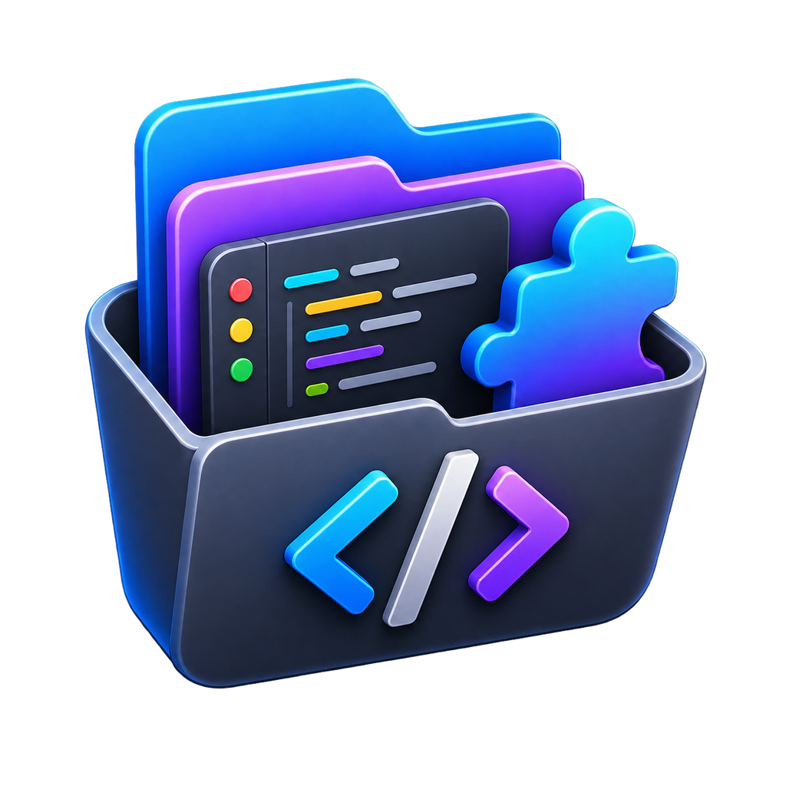
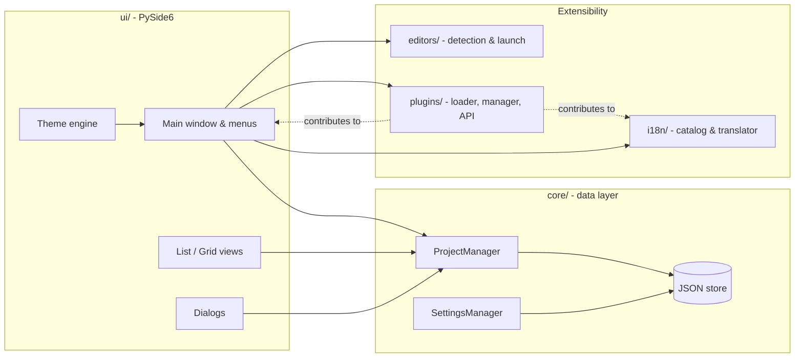

<p align="center">
  
</p>

<h1 align="center">MyAppsLibrary</h1>

<p align="center">
  <strong>A fast, native desktop launcher for every developer project you own - organized, searchable, and one click away from your favorite editor.</strong>
</p>

<p align="center">
  <a href="README.fr.md">🇫🇷 Lire en français</a>
</p>

<p align="center">
  <a href="https://github.com/rodolphe37/my-apps-library/actions/workflows/ci.yml"></a>
  <a href="LICENSE"></a>
  <a href="pyproject.toml"></a>
  <a href="https://pypi.org/project/PySide6/"></a>
  
  <a href="https://github.com/astral-sh/ruff"></a>
  <a href="CHANGELOG.md"></a>
  <a href="CONTRIBUTING.md"></a>
</p>

<p align="center">
  
  
  
</p>

---

## Table of contents

- [Overview](#overview)
- [Features](#features)
- [Supported editors](#supported-editors)
- [Installation](#installation)
- [Getting started](#getting-started)
- [The plugin system](#the-plugin-system)
- [Internationalization](#internationalization)
- [Architecture](#architecture)
- [Project layout](#project-layout)
- [Development](#development)
- [Packaging / building installers](#packaging--building-installers)
- [Roadmap](#roadmap)
- [Contributing](#contributing)
- [Community](#community)
- [License](#license)
- [Author](#author)

## Overview

If your projects live scattered across a dozen folders, on different drives, in different states of "I'll get back to this" - **MyAppsLibrary** is a small, native desktop app that gives them one home. Point it at a folder once, and from then on you get a searchable, filterable, categorized library that opens any project in the editor of your choice with a single click.

It is **not** a cloud service, an account system, or a project manager with opinions about your workflow. It stores nothing but folder references and metadata, entirely on your machine, and never touches your files or reaches out to the network on its own.

- 🖥️ **Native desktop app** - built with [PySide6](https://doc.qt.io/qtforpython/) (Qt for Python), not Electron
- 🔒 **Local-first & offline** - your project list lives in a local JSON store; nothing is uploaded anywhere
- 🧩 **Extensible** - a VS Code-style plugin system lets the community add features without forking
- 🌍 **Multilingual** - English and French out of the box, more via plugins
- 🎨 **Themeable** - light/dark mode that follows your OS, built around the app's own brand gradient

## Features

- **Add / remove projects** - folder references only, your files are never touched or moved. Add via dialog or **drag-and-drop** of one or more folders, in either list or grid view.
- **Multi-select** - `Ctrl`/`Cmd`-click and `Shift`-click range-select (the same convention as Finder/Explorer), with bulk actions: edit categories, pin/unpin, and remove, all applied to the whole selection at once.
- **Fully custom categories**, no built-in/generic categories. Create as many as you want (**Project → Manage Categories…**), assign a project to several at once via right-click → **Edit Categories…** (bulk-aware, with tri-state checkboxes when the selection is mixed), or drag a project onto a category in the sidebar to move it there directly. Categories and individual projects can each have a custom icon (**Icon…**/right-click → **Choose Icon…**), picked from a built-in set or any pack a plugin contributes, overlaid on a project's folder shape rather than replacing it.
- **Sort** by name, date added, date modified (the folder's own filesystem timestamp), or size, ascending or descending (**View → Sort By**) - pinned projects always float to the top regardless of sort order.
- **Search & filter** by name and by category.
- **List and grid/thumbnail views**, toggled from the View menu, with selection preserved across the switch.
- **Auto-detected editors** - VS Code, Cursor, Sublime Text, JetBrains IDEs, Zed, VSCodium, and more (see [Supported editors](#supported-editors)); open a project directly in one, or use **"Open With…"** to pick a different editor or register a custom one.
- **Reveal in file manager** - right-click → "Show in Finder/Explorer" to jump straight to a project's folder.
- **Light/dark theme** with automatic OS detection plus a manual switch, and a choice of **color palette** (**Preferences → Color palette**): the built-in default, or any palette a plugin contributes, each with its own light+dark variant. The whole UI (selection outline, sidebar, buttons) is themed around the app's blue-to-purple logo gradient by default (see [`src/myapps/ui/theme/brand.py`](src/myapps/ui/theme/brand.py)); a selected project is shown with an accent-colored border rather than a filled background, so its own icon/chip colors stay legible.
- **Native menu bar** with all major actions, keyboard-friendly throughout.
- **Plugin system**, install from a local `.zip` or folder, enable/disable from **Plugins → Manage Plugins…**; plugins can contribute context-menu actions, menu actions, new view modes, icon packs, color palettes, and translations. **Plugins → Browse Marketplace…** opens a companion plugins marketplace web app in your browser (source kept in a private repository); installs themselves remain local `.zip`/folder only, no marketplace account or network dependency required for that.
- **Multi-language UI** - English and French built in, switchable live from **Preferences → Language** with no restart, and extensible by third-party translation plugins.
- **Update check** - on startup, silently checks GitHub's latest release against the running version; if a newer one exists, a dialog shows the exact upgrade command for your OS. The only network call the app makes on its own initiative, and it fails silently (no error dialog) if you're offline or GitHub is unreachable.

> Planned next: code signing/notarization, auto-update. See the [Roadmap](#roadmap).

## Supported editors

MyAppsLibrary auto-detects whichever of these are installed on your system:

| Editor | | Editor | |
|---|---|---|---|
| Visual Studio Code | ✅ | IntelliJ IDEA | ✅ |
| VS Code – Insiders | ✅ | WebStorm | ✅ |
| Cursor | ✅ | GoLand | ✅ |
| VSCodium | ✅ | CLion | ✅ |
| Sublime Text | ✅ | RubyMine | ✅ |
| Zed | ✅ | Neovide (Neovim) | ✅ |
| PyCharm | ✅ | *your favorite, via "Open With…"* | ➕ |

Don't see yours? Use **"Open With…"** to add any custom editor by path, or open a PR against [`src/myapps/editors/catalog.py`](src/myapps/editors/catalog.py) - see [Contributing](#contributing).

## Installation

MyAppsLibrary isn't code-signed/notarized (see the [Roadmap](#roadmap) for why that's a deliberate choice, not an oversight) - pick whichever tradeoff below suits you.

### macOS

Two options, not a progression - pick one:

```bash
# Option 1: Homebrew - clean /Applications install + `brew upgrade`/`uninstall`,
# but expect a one-time right-click → Open on first launch (unsigned app).
brew tap rodolphe37/my-apps-library
brew install --cask my-apps-library

# Option 2: install script - zero Gatekeeper warning at all (curl/ditto never
# trigger it, unlike a browser download or Homebrew Cask - both apply
# com.apple.quarantine deliberately), but no update mechanism: re-run this
# script to update instead of `brew upgrade`.
curl -fsSL https://raw.githubusercontent.com/rodolphe37/my-apps-library/main/packaging/macos/install.sh | bash
```

### Windows

```powershell
winget install rodolphe37.MyAppsLibrary
```

Not published to the `winget-pkgs` community repo yet - see [`packaging/winget/README.md`](packaging/winget/README.md), so this command won't resolve for anyone right now. Until it's merged, grab [`MyAppsLibrary-Windows.zip` from the latest release](https://github.com/rodolphe37/my-apps-library/releases/latest), extract it, and run `MyAppsLibrary.exe` inside - it's a portable app, no installer, so keep the extracted folder wherever you want it to live. Expect a SmartScreen "Windows protected your PC" prompt on first launch either way (same unsigned-app reason as macOS) - click **More info → Run anyway**.

### Linux

```bash
curl -fsSL https://raw.githubusercontent.com/rodolphe37/my-apps-library/main/packaging/linux/install.sh | bash
```

Downloads the latest release, installs to `~/.local/share/my-apps-library/`, and registers a proper application-menu entry (`.desktop` file + icon) - a bare `curl`+`chmod +x` alone would run fine but wouldn't show up in your launcher.

### Manual download

Grab the right `.zip` directly from [the latest release](https://github.com/rodolphe37/my-apps-library/releases/latest) if you'd rather skip all of the above.

### Contributing to the app itself

If you're working on MyAppsLibrary's own source (not just using it), run from a checkout instead:

```bash
git clone https://github.com/rodolphe37/my-apps-library.git
cd my-apps-library

python3 -m venv .venv
source .venv/bin/activate      # Windows: .venv\Scripts\activate

pip install -e ".[dev]"
python -m myapps
```

Requirements: **Python 3.11+** and a desktop environment capable of running Qt applications (Windows, macOS, or Linux with a display server).

## Getting started

1. Launch the app with `python -m myapps` (or the installed `myapps` command).
2. **Add your first project**: `Project → Add Project…`, or just drag a folder onto the window.
3. **Organize**: create categories from `Project → Manage Categories…`, then drag projects onto a category in the sidebar, or right-click → *Edit Categories…* for bulk assignment.
4. **Open it**: click a project to open it in its default detected editor, or right-click → *Open With…* to choose another one.
5. **Make it yours**: switch theme and language from `Preferences`, pin your most-used projects, and try the *List*/*Grid* views from the `View` menu.

## The plugin system

MyAppsLibrary ships with a small, VS Code-style plugin API so the community can extend the app without forking it.

- Install a plugin from a local `.zip` or folder via **Plugins → Manage Plugins…**
- A plugin can contribute:
  - **Context-menu actions** on projects (`contribute_project_context_actions`)
  - **Menu-bar actions** (`contribute_menu_actions`)
  - **New view modes** (`contribute_views`)
  - **Icon packs** for categories and projects (`contribute_icon_packs`)
  - **Color palettes**, light + dark, selectable from Preferences (`contribute_theme_palettes`)
  - **Translations**, new locales or overrides of existing ones (`contribute_translations`)
  - Lifecycle hooks: `on_load`, `on_unload`, `on_project_added`, `on_project_removed`, `on_project_opened`
- Every plugin receives a single `PluginContext` object (never raw app internals), see [`src/myapps/plugins/api.py`](src/myapps/plugins/api.py) for the full contract.
- Plugins currently run with full app privileges and are **not sandboxed**; the app shows a one-time trust disclosure before enabling a new plugin. Real sandboxing is tracked on the [Roadmap](#roadmap).

Three working, minimal examples are included:

| Plugin | Demonstrates |
|---|---|
| [`examples/plugins/open_in_terminal`](examples/plugins/open_in_terminal) | Context-menu contribution, `permissions` declaration |
| [`examples/plugins/recently_opened_logger`](examples/plugins/recently_opened_logger) | `on_project_opened` hook, menu contribution, `ctx.storage_dir`, `ctx.settings` |
| [`examples/plugins/german_translation`](examples/plugins/german_translation) | Adding a whole new locale (`de`) via `contribute_translations` |

A real, published example is also live on the marketplace: [Theme & Icons Pack](https://marketplace.rodolphe-augusto.fr/plugins/theme-and-icons-pack) demonstrates `contribute_icon_packs` and `contribute_theme_palettes` together, with a full listing (description, screenshots) written through the `mal-plugin` CLI.

**`Plugins → Browse Marketplace…`** opens a companion plugins marketplace web app (its source lives in a separate, private repository, not part of this project). Reads the `MYAPPS_MARKETPLACE_URL` environment variable, defaulting to the live marketplace at `https://marketplace.rodolphe-augusto.fr`; only set that variable yourself to point at a local dev instance instead (`http://localhost:5173`).

## Internationalization

The UI ships with **English** and **French**, switchable live from **Preferences → Language** - no restart required. Translations live in [`src/myapps/i18n/locales/`](src/myapps/i18n/locales/) as flat JSON key/value catalogs, loaded through [`src/myapps/i18n/translator.py`](src/myapps/i18n/translator.py).

Adding a language is deliberately low-friction:

- **As a core locale**: add `src/myapps/i18n/locales/<code>.json` mirroring `en.json`'s keys, including the reserved `meta.language_name` key for its display name in the Settings dropdown.
- **As a plugin**: implement `contribute_translations()` to add a new locale or patch strings in an existing one - see [`examples/plugins/german_translation`](examples/plugins/german_translation) for a full working example.

Missing keys fall back to English, so a partial or in-progress translation never breaks the UI. Contributions of additional languages are very welcome - see [Contributing](#contributing).

## Architecture



Everything persists to a local, atomically-written JSON store (see [`src/myapps/core/store.py`](src/myapps/core/store.py)) under your OS's standard app-data directory (via [`platformdirs`](https://pypi.org/project/platformdirs/)) - no database, no server, no network calls from the core app.

## Project layout

```
src/myapps/
├── core/          # Data layer - models, ProjectManager, SettingsManager, JSON store
├── editors/        # Editor detection (macOS/Windows/Linux) & launch
├── plugins/         # Plugin system - manifest, loader, manager, public API
├── i18n/            # Translation catalog, tr(), built-in en/fr locales
├── ui/              # PySide6 widgets, dialogs, views, theming
│   └── theme/        # brand.py (source-of-truth colors), palettes, QSS
└── utils/           # Filesystem & process helpers, logging

packaging/         # PyInstaller spec, OS-specific metadata, icons
examples/plugins/  # Working example plugins
tests/
├── unit/           # Fast, no-GUI unit tests
└── integration/    # pytest-qt integration tests
```

## Development

```bash
python3 -m venv .venv
source .venv/bin/activate      # Windows: .venv\Scripts\activate
pip install -e ".[dev]"
python -m myapps
```

**Run the test suite:**

```bash
pytest
```

**Lint:**

```bash
ruff check src tests examples
```

The project targets **Python 3.11+**, uses [`ruff`](https://github.com/astral-sh/ruff) for linting (`E`, `F`, `I`, `UP`, `B` rule sets, 100-char lines), and [`pytest`](https://docs.pytest.org/) + [`pytest-qt`](https://pytest-qt.readthedocs.io/) for testing, including headless GUI integration tests.

## Packaging / building installers

Native builds only - PyInstaller does not cross-compile, so each OS's build must run on that OS.

```bash
pip install -e ".[dev]"
pyinstaller packaging/pyinstaller/myapps.spec --noconfirm
```

See [`packaging/README.md`](packaging/README.md) for the full per-OS process (`.dmg` on macOS, installer on Windows, `AppImage` on Linux) and [`packaging/icons/README.md`](packaging/icons/README.md) for regenerating app icons from new artwork.

A [`Package` GitHub Actions workflow](.github/workflows/package.yml) builds unsigned bundles for all three OSes automatically - but only on pushes to `main` (i.e. after a maintainer merges a reviewed PR) or a manual run, never on contributor pull requests. Builds are attached to the workflow run as downloadable artifacts under the repo's **Actions** tab.

## Roadmap

- [x] ~~Code signing & notarization~~ - deliberately not pursuing this (see [Installation](#installation)): Homebrew Cask/winget/an install script give a reasonable install experience without the $99/year Apple Developer Program or Windows Authenticode cert. Revisit only if the unsigned-app friction turns out to matter more than expected.
- [x] ~~Publish the Homebrew tap~~ - [`rodolphe37/homebrew-my-apps-library`](https://github.com/rodolphe37/homebrew-my-apps-library) is live, `version`/`sha256` bumped automatically on every release ([`packaging/homebrew/`](packaging/homebrew/))
- [ ] Submit the winget manifest to `microsoft/winget-pkgs` - written and ready (`packaging/winget/`), not submitted yet
- [x] ~~In-app update check~~ - on startup, checks GitHub's latest release against the running version and shows the exact upgrade command for the current OS if there's a newer one (since v0.7.0)
- [ ] Real plugin sandboxing (today plugins run with full app privileges)
- [x] ~~Public deployment of the plugins marketplace web app~~ - live at [marketplace.rodolphe-augusto.fr](https://marketplace.rodolphe-augusto.fr) (its source stays in a private repository; only the live site is public)
- [ ] More built-in languages

Have an idea? [Open an issue](https://github.com/rodolphe37/my-apps-library/issues/new/choose) - see [Contributing](#contributing).

## Contributing

Contributions, bug reports, and ideas are genuinely welcome - this started as a personal tool and is now open for anyone to help shape. Please read [`CONTRIBUTING.md`](CONTRIBUTING.md) for the full guide (setup, coding style, commit conventions, PR process) and [`CODE_OF_CONDUCT.md`](CODE_OF_CONDUCT.md) before participating.

Good first stops:

- 🐛 [Report a bug](.github/ISSUE_TEMPLATE/bug_report.md)
- ✨ [Suggest a feature](.github/ISSUE_TEMPLATE/feature_request.md)
- 🧩 Write a [plugin](#the-plugin-system) or a new [translation](#internationalization)
- 🖥️ Add support for another [editor](#supported-editors)

## Community

- **Bugs & features**: [GitHub Issues](https://github.com/rodolphe37/my-apps-library/issues)
- **Security concerns**: please see [`SECURITY.md`](SECURITY.md) - do not open a public issue for vulnerabilities
- **Changelog**: [`CHANGELOG.md`](CHANGELOG.md)

## License

MyAppsLibrary is distributed under the [PolyForm Noncommercial License 1.0.0](LICENSE). You're free to use, modify, and redistribute it for any **noncommercial** purpose (personal use, learning, research, nonprofit/educational/government use, contributing back, etc.). **Commercial use is not permitted** under this license - if you'd like to use MyAppsLibrary commercially, please [get in touch](https://github.com/rodolphe37) to discuss a separate license.

This also means external contributions are accepted under these same noncommercial terms - see [Contributing](#contributing).

## Author

Built and maintained by **[Rodolphe Augusto](https://github.com/rodolphe37)**.

<p align="center">
  <sub>If MyAppsLibrary saves you a few clicks a day, consider starring the repo ⭐</sub>
</p>
